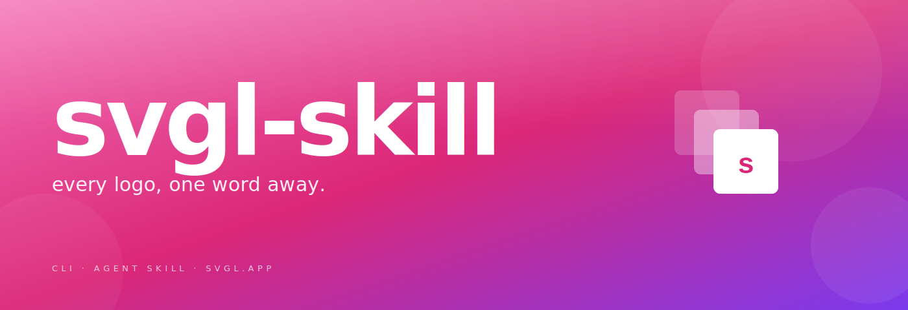

<div align="center">
  <a href="https://github.com/saphid/svgl-skill">
    
  </a>
</div>

<hr />

[](https://github.com/saphid/svgl-skill/releases)
[](https://nodejs.org)
[](https://github.com/saphid/svgl-skill)
[](package.json)
[](SKILL.md)
[](https://svgl.app)
[](LICENSE)

**`svgl-skill`** is a small, opinionated CLI for pulling brand marks out of [svgl.app](https://svgl.app). Works as a human terminal tool and as an agent skill.

Small, but not only small.

```ts
// in your terminal
svgl show stripe

// in your agent harness
const skill = require('svgl-skill')
await skill.download('linear', { theme: 'dark', out: './brand' })
```

## Quick Start

```bash
git clone https://github.com/saphid/svgl-skill ~/svgl-skill
~/svgl-skill/svgl.js show linear
```

## Features

- **Instant** — ranked matches from svgl.app in under 200 ms
- **Inline preview** — `svgl show <brand>` renders directly into iTerm2 or Kitty
- **Format-agnostic** — SVG, PNG, JPG, JPEG, GIF, all behind one flag
- **Zero dependencies** — pure Node, no `sharp`, no `canvas`, no postinstall
- **Harness-ready** — drop straight into pi, Claude Code, or Codex CLI
- **Theme aware** — `--theme dark`, `--theme light`, `--theme auto`

## Documentation

The manual lives at [`docs/`](docs/). Upstream API at [svgl.app/docs/api](https://svgl.app/docs/api).

## Communication

- [GitHub issues](https://github.com/saphid/svgl-skill/issues) — bugs, feature requests
- [svgl.app](https://svgl.app) — the catalog itself

## Contributing

PRs welcome. Open an issue first for anything larger than a typo.

## Contributors

Thanks to [everyone who has contributed](https://github.com/saphid/svgl-skill/graphs/contributors).

## License

MIT. Brand marks belong to their respective owners; SVGL is the catalog, not the licensor.
